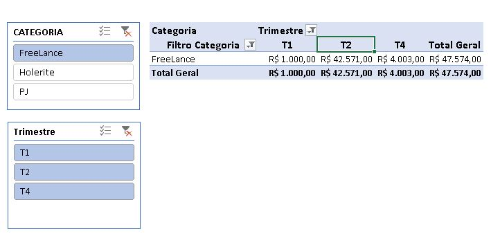
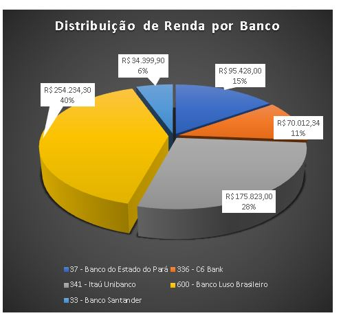
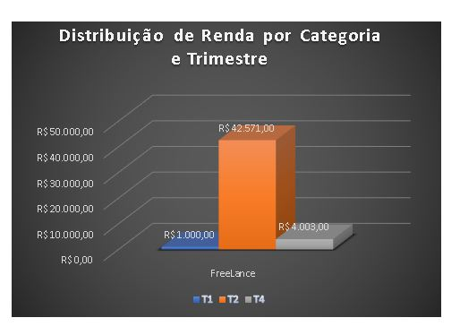

# DIO_Excel_APP_Declara_IR
Este é um projeto de estudo para por em prática conhecimentos apurados no BOOTCAMP SANTANDER &amp; DIO Análise de dados com EXCEL. Em 10/02/2026.

# 📊 APP Suporte IR — Consolidador Estruturado para declaração de Imposto de Renda


---

## 📌 Sumário

- [Visão Geral do Projeto](#-visão-geral-do-projeto)
- [Contexto de Negócio](#-contexto-de-negócio)
- [Arquitetura da Planilha](#-arquitetura-da-planilha)
- [Navegação Entre Abas](#-navegação-entre-abas)
- [Onde Inserir Dados](#-onde-inserir-dados)
- [Estrutura de Cálculos](#-estrutura-de-cálculos)
- [Tabelas Dinâmicas e Dashboard](#-tabelas-dinâmicas-e-dashboard)
- [Diferenciais Técnicos](#-diferenciais-técnicos)
- [Competências Demonstradas](#-competências-demonstradas)

---

# 📌 Visão Geral do Projeto

O **APP Suporte IR** é uma aplicação desenvolvida em Excel com foco na:

- Consolidação estruturada de documentos fiscais
- Organização de informes de rendimentos
- Totalização automática para apoio à declaração de IR
- Visualização executiva por meio de gráficos e tabelas dinâmicas

A solução foi modelada com abordagem semelhante a um **mini-sistema modular**, separando claramente:

Entrada de Dados → Processamento → Consolidação → Visualização

---

# 💼 Contexto de Negócio

Durante o período de declaração de Imposto de Renda, é comum ocorrer:

- Desorganização de informes
- Divergência de valores
- Dificuldade na consolidação manual
- Risco de omissão ou duplicidade

O App foi estruturado para:

✔ Centralizar dados fiscais  
✔ Reduzir risco operacional  
✔ Padronizar consolidação  
✔ Facilitar auditoria interna  
✔ Melhorar clareza visual  

Não substitui sistema oficial da Receita, mas atua como **ferramenta de apoio organizacional e gerencial**.

---

# 🏗 Arquitetura da Planilha

A estrutura segue separação lógica:

| Camada | Função |
|--------|--------|
| Entrada | Informes e documentos |
| Processamento | Totalizações e referências |
| Consolidação | Resumo estruturado |
| Visualização | Tabelas Dinâmicas e Gráficos |

Essa modelagem evita mistura entre dados brutos e cálculos.

---

# 🧭 Navegação Entre Abas

A planilha foi construída com fluxo intuitivo:

1. **Titular** → Coleta dos dados do declarante do IR.
2. **Informes** → Inserção de dados referente as declarações feitas por cada instituição bancária
3. **Notas / Registros** → Informe de seu rendimentos seja como CLT, PJ ou FreeLance todas as rendas recebidas
4. **Consolidado** → Totalizações automáticas feito tanto na planilha de Informes quanto Notas
5. **Resumo Dinâmico** → Tabela Dinâmica criada na planilha Analise, com o objetivo de análise das receitas
6. **Análise** → Permite tanto a segmetação quanto a Visualização de dados.

A navegação é estruturada por:

- Organização sequencial de abas
- Separação visual clara
- Hierarquia funcional

Fluxo lógico:

`Entrada →  Títula → Informes → Notas → Análise`

---

# ✏️ Onde Inserir Dados

A edição ocorre exclusivamente em:

- Aba **Títular**
- Aba **Informes**
- Aba **Notas**

Campos editáveis são destinados a:

- Dados do declarante
- Valores recebidos nas instituições e documentos
- Identificação de fonte pagadora

⚠️ Não alterar:
- Células com fórmulas
- Áreas de consolidação
- Tabela Dinâmica

---

# 🧮 Estrutura de Cálculos

## Fórmulas efetivamente utilizadas

### Totalizações

```excel
=SUM(intervalo)
```

---
<section>
- Aplicada para:
 <br>Somar valores por categoria</br>
 Consolidar rendimentos
 <p>Gerar totais finais</p>
</section>


## 🧮 Principais Recursos Utilizadas
<div>
</p>
- <b>Segmetação de Dados</b>  
  <p>&nbsp;&nbsp;&nbsp;&nbsp;Utilizamos a segmetação para que o usuário possa de forma clara 
    analisar categorias x períodos trimestrais de rendimentos.</p>
  

</p>
- <b>Gráficos pizza</b>
  <p>&nbsp;&nbsp;&nbsp;&nbsp;Utilizamos para ver claramente os bancos que contém o maior rendimento ou depositos.</p>
  

</p>
- *<b>Grafico de barras</b>
  <p>&nbsp;&nbsp;&nbsp;&nbsp;Utilizamos para verificar a distribuição de renda por categoria por trimestre.</p>
  

</p>
- <b>Navegação entre as planilhas</b>
<p>&nbsp;&nbsp;&nbsp;&nbsp;Utilizamos o recurso de <q><b>links</q></b> para navegação entre as planilhas, gerando um ar de automação e ainda condicionando o usuário a fazer o que esta definido, logo possivelmente teremos pouco problemas de assistência</p> 

</p>
- <b>Referência Entre Abas</b>
</p>

   ```=Informes!C10```

Utilizada para:

*   Transportar dados consolidados
*   Modularizar cálculos
*   Garantir organização estrutural

</div>
</p>
</p>

## 👨‍💻 Desenvolvedor
<p>
    <p>&nbsp&nbsp&nbspAlvaro Monteiro<br>
    &nbsp&nbsp&nbsp
    <a href="https://github.com/Alvaro-MSJR">
    GitHub</a>&nbsp;|&nbsp;
    <a href="www.linkedin.com/in/alvaro-monteiro-silva">LinkedIn</a>
&nbsp;|&nbsp;</p>
</p>
<br/><br/>
<p>

---
⌨️ conteúdo por [Alvaro Monteiro](https://github.com/Alvaro-MSJR)